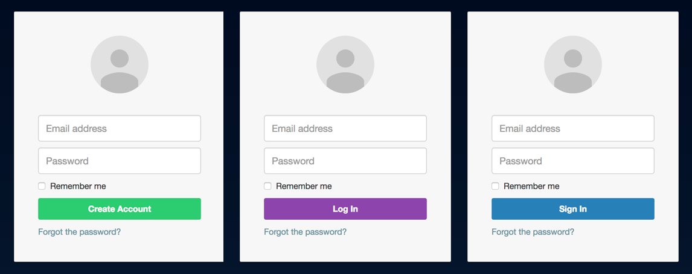

# gatsby-autotune-demo

This is a static webpage generated with `gatsby` which uses an experimental
library called `autotune` to automatically A/B test some options for the
primary action on a fictional login dialog:



`autotune` must complete asynchronous initialization before displaying the login dialog, so I've added this to `gatsby-browser.js`:

```js
import * as autotune from 'autotune'

exports.onClientEntry = async () => {
  await autotune.initialize('2e7c3598-62c0-4e90-9d5f-48921bd4ee82')
}
```

Then I render the login button as a component using `autotune.oneOf` to create some variable colors and labels to be A/B tested:

```jsx
import { oneOf } from 'autotune'

const LoginButton = () => (
  <button
    type="submit"
    style={{
      backgroundColor: oneOf('Login Primary Action – Background Color', [
        '#8e44ad',
        '#2980b9',
        '#2c3e50',
        '#2ecc71',
      ]),
    }}
  >
    {oneOf('Login Primary Action', ['Sign In', 'Log In', 'Create Account'])}
  </button>
)
```

All of this works locally with `gatsby develop`, but when I try to `gatsby build` the site for deployment, a few things go wrong:

1.  The `async`/`await` call in `gatsby-browser.js` seems to cause problems. Is there another place I should call this?
1.  `gatsby` calls `oneOf` in the `node` environment (server-side) before `initialize` is called, causing errors. I want `oneOf` calls to happen on the client so `LoginButton` is determined at runtime. Can I change this?
